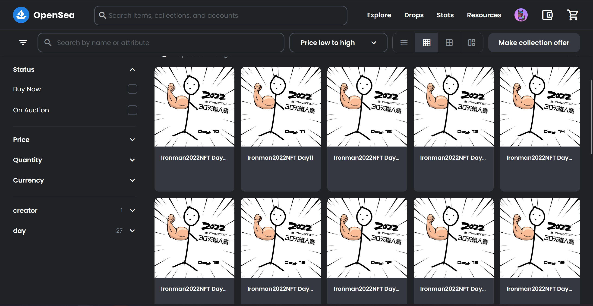

# 2022 iThome鐵人賽NFT - 教學系列

## 一個基於ERC-721標準的簡易智能合約, 區塊鏈背後原理大解析！

此專案源自於第14th鐵人賽, 希望可以透過30天的教學, 帶領大家一步一步認識區塊鏈的世界. 從區塊鏈的基礎原理及技術開始認識,
接著實際入金購買虛擬貨幣及NFT, 再以技術面的角度分析智能合約, 最終撰寫智能合約並上鏈一個NFT系列專屬此次的比賽並限量！

## 觀看完整的教學文章:

### > 來認識區塊鏈及比特幣吧！

- [[Day 1] | 目錄與引言 | NFT、區塊鏈、比特幣到底是什麼？ 發出屬於自己的NFT吧！](https://ithelp.ithome.com.tw/articles/10290445)
- [[Day 2] 區塊鏈的起源與比特幣](https://ithelp.ithome.com.tw/articles/10290593)
- [[Day 3] 比特幣揭密! 背後的實際運作原理 ](https://ithelp.ithome.com.tw/articles/10291331)
- [[Day 4] 挖礦？比特幣運行的必需品 其實比特幣有限量！（一）交易識別確認](https://ithelp.ithome.com.tw/articles/10291411)
- [[Day 5] 挖礦？比特幣運行的必需品（二）雜湊運算 ](https://ithelp.ithome.com.tw/articles/10291678)
- [[Day 6] 挖礦？比特幣運行的必需品（三）看懂區塊](https://ithelp.ithome.com.tw/articles/10292097/)
- [[Day 7] 區塊鏈不一定去中心化?](https://ithelp.ithome.com.tw/articles/10292546/)
- [[Day 8] 公有鏈的第二王者 - 以太坊 ](https://ithelp.ithome.com.tw/articles/10293267)
- [[Day 9] 以太坊的真實力！ 各種去中心化應用](https://ithelp.ithome.com.tw/articles/10293450)
- [[Day 10] 3分鐘帶你了解NFT！不就是一隻猴子? 為什麼一張圖片能賣幾千萬...](https://ithelp.ithome.com.tw/articles/10294266/)
- [[Day 11] 數位收藏品NFT的應用 價值連城是詐騙嗎?](https://ithelp.ithome.com.tw/articles/10294799/)

### > 要當韭菜了嗎？購買虛擬貨幣及NFT

- [[Day 12] 從頭購買我的第一枚比特幣！（一）國外交易所介紹](https://ithelp.ithome.com.tw/articles/10296037/)
- [[Day 13] 從頭購買我的第一枚比特幣！（二）國內交易所及入金](https://ithelp.ithome.com.tw/articles/10296858)
- [[Day 14] 從頭購買我的第一枚比特幣！（三）轉移資產並購買比特幣](https://ithelp.ithome.com.tw/articles/10297630)
- [[Day 15] 從頭購買我的第一枚比特幣！（四）去中心化小狐狸錢包](https://ithelp.ithome.com.tw/articles/10298258)
- [[Day 16] 購買人生的中第一個NFT！ 其實超簡單](https://ithelp.ithome.com.tw/articles/10299145)
- [[Day 17] FOMO到底是什麼意思? 幣圈常見用語大解析！](https://ithelp.ithome.com.tw/articles/10299590/)

### > 別再騙人了！看懂智能合約

- [[Day 18] 看懂智能合約，如何在以太坊上運行? ](https://ithelp.ithome.com.tw/articles/10301198)
- [[Day 19] 從BAYC猴子的智能合約 看懂背後運作原理（一）Etherscan ](https://ithelp.ithome.com.tw/articles/10301987)
- [[Day 20] 從BAYC猴子的智能合約 看懂背後運作原理（二）ERC721標準與OpenZeppelin](https://ithelp.ithome.com.tw/articles/10302184/)
- [[Day 21] 從BAYC猴子的智能合約 看懂背後運作原理（三）其實BAYC的合約有漏洞！ ](https://ithelp.ithome.com.tw/articles/10303065)
- [[Day 22] 從BAYC猴子的智能合約 看懂背後運作原理（四）Metadata與IPFS](https://ithelp.ithome.com.tw/articles/10303704/)

### > 鐵人賽NFT製作

- [[Day 23] 新手也能創造NFT！ OpenSea上手，3分鐘販賣你的NFT](https://ithelp.ithome.com.tw/articles/10304479)
- [[Day 24] 建造鐵人賽專屬NFT！（一）開發環境Remix與OpenZeppelin使用, 新手懶人輕鬆上手！](https://ithelp.ithome.com.tw/articles/10304855)
- [[Day 25] 建造鐵人賽專屬NFT！（二）把寫好的合約部屬上測試鏈Goerli！竟然還有測試用OpenSea?!](https://ithelp.ithome.com.tw/articles/10305330)
- [[Day 26] 建造鐵人賽專屬NFT！（三）設定NFT總數, 並限制一人只能鑄造一個](https://ithelp.ithome.com.tw/articles/10305417)
- [[Day 27] 建造鐵人賽專屬NFT！（四）強化每人只能鑄造一枚NFT的邏輯與實作 ](https://ithelp.ithome.com.tw/articles/10305511)
- [[Day 28] 建造鐵人賽專屬NFT！（五）設定圖片/名稱Metadata並上傳至IPFS！ ](https://ithelp.ithome.com.tw/articles/10306474)
- [[Day 29] 建造鐵人賽專屬NFT！（終）快來免費鑄造鐵人賽專屬NFT！限量30個 正式上鏈](https://ithelp.ithome.com.tw/articles/10307778)
- [[Day 30] 完賽心得與感想 謝謝看完的各位！](https://ithelp.ithome.com.tw/articles/10308091)

## 此智能合約專案的功能

(使用OpenZeppelin開源函式庫)

* 設定NFT代幣總量
* 設定NFT代幣的Metadata
* 限制錢包鑄造數量
* ----(未實作但有此功能, 請參考[這裡](https://ithelp.ithome.com.tw/articles/10304855))---
* NFT代幣燒毀
* 鑄造階段暫停

## 如何使用?

1. 進入[Remix官網](https://remix.ethereum.org)
2. 點擊WorkSpaces右側列表的"Clone"
3. 貼上此專案的GitHub連結
4. 開始使用! 歡迎參考上面系列教學

## 支持我做出更多開源內容

如果你認為此教學對你有幫助, 歡迎打賞加密貨幣至此

以太坊錢包地址: `hot.happygroup.eth`